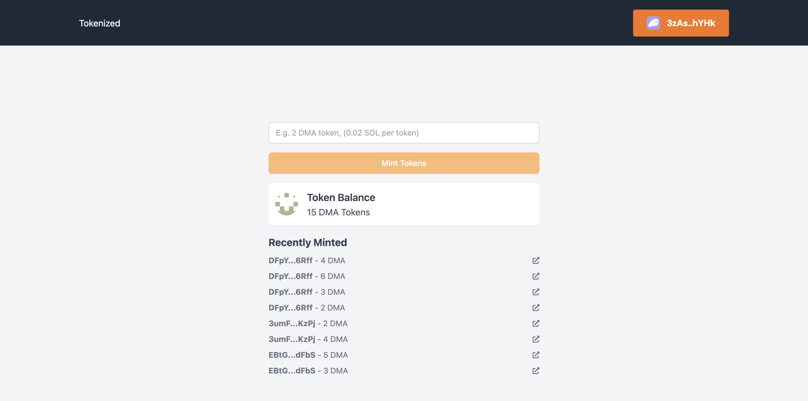

# Tokenizer

This project is a Token Sale dApp that allows one to buy tokens and also displays recently minted tokens on the Solana blockchain using the SPL SDK. It provides a user-friendly interface to view minting transactions, including the receiver's address, the amount of tokens minted, and links to the transaction and address on the Solana explorer.

## Features

- Allows users to buy tokens
- Display a list of recently minted tokens
- Show receiver's address and amount of tokens minted
- Provide links to transaction and address on Solana explorer

## Technologies Used

- React
- Next.js
- TypeScript
- Solana Web3.js
- SPL Token
- React Icons
- Redux Toolkit
- Tailwind CSS
- Solana Wallet Adapter
- Phantom

## Caveat

**Warning:** Before using this dApp, ensure that you have the Phantom wallet installed on your browser. The dApp requires the Phantom wallet for interacting with the Solana blockchain. You can download and install the Phantom wallet from [here](https://phantom.app/).

## Important Note

Before running the project, ensure that your default Solana cluster is set to `devnet`. This is crucial for testing and development purposes. If you intend to deploy this project to `mainnet` or `testnet`, make sure to update your configuration accordingly. You can set the cluster by configuring your Solana CLI or by setting the appropriate environment variables in your project.

To set your default Solana cluster to `devnet`, you can use the following command: 
  ```bash
  solana config set --url https://api.devnet.solana.com
  ```


## Installation

To get started with the project, follow these steps:

1. **Clone the repository:**

   ```bash
   git clone https://github.com/Daltonic/solana_tokenize_project
   cd solana_tokenize_project
   ```

2. **Install dependencies:**

   ```bash  
   npm install
   ```

3. **Set up environment variables:**
   Create a `.env` file in the root directory and add the keypair of the mint authority, that is the deployer of this token.

   ```env
   NEXT_PUBLIC_TOKEN_OWNER_KEY_PAIR=<A_STRING_OF_TOKEN_OWNER_KEY_PAIR>
   ```

4. **Run the following scripts on after the other:**

   ```bash
   npm run launch
   ```

5. **Run the development server:**

   ```bash
   npm run dev
   ```

5. **Build for production:**
   ```bash
   npm run build
   npm start
   ```

## Usage

Once the development server is running, you can access the dApp by navigating to `http://localhost:3000` in your web browser. The dashboard will display a list of recently minted tokens, including the receiver's address, the amount of tokens minted, and links to the transaction and address on the Solana explorer.

## Project Structure

- `components/`: Contains React components used in the project
  - `MintHistory.tsx`: Component to display the mint history
- `services/`: Contains service functions for interacting with the Solana blockchain
  - `blockchain.ts`: Functions for fetching mint history, buying tokens, and getting token balance
- `utils/`: Contains utility types and functions
  - `types.dt.ts`: Type definitions for the project

## Contributing

Contributions are welcome! If you have any suggestions or improvements, please create an issue or submit a pull request.

## License

This project is licensed under the MIT License. See the [LICENSE](LICENSE) file for more details.
